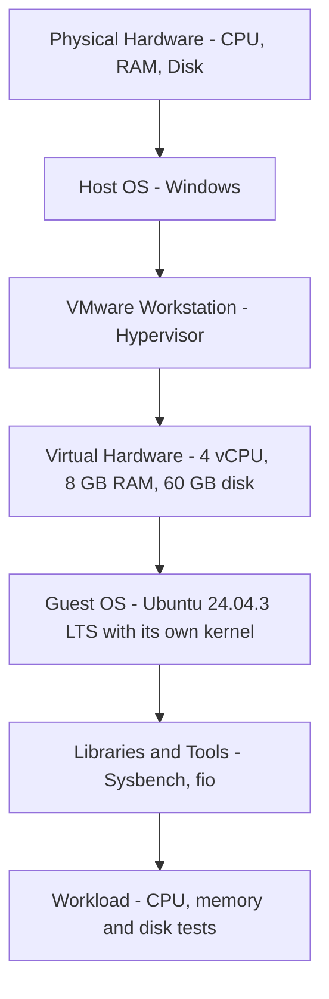
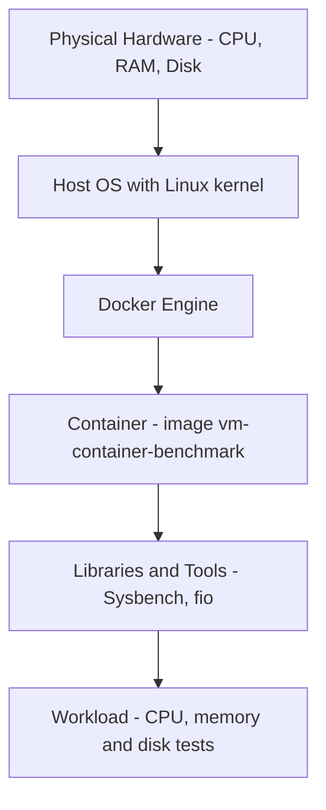

# Performance Analysis of Virtual Machines and Containers

Cloud Computing Lab - Experiment 2 | VMware Workstation VM vs Docker Container

---

## Aim

To experimentally compare the performance of an Ubuntu Virtual Machine running on VMware Workstation and a Docker container, using the same CPU, memory and disk I/O workloads.

## Abstract

In this experiment I compared an Ubuntu Virtual Machine (VMware Workstation) and a Docker container running the same Sysbench and fio workloads. CPU and memory tests were repeated 10 times in each environment and the averages were compared. Disk I/O was tested with a sequential write in both environments. The container gave a higher average CPU score (+11.77%), a lower average memory throughput (-26.63%) and a slightly higher sequential write bandwidth (+10.00%) than the VM. The container was run inside the same VM, so the results compare direct execution in the VM with a container inside the VM.

## Objectives

- To compare the performance of a VM and a container under the same workload
- To compare CPU, memory and disk I/O performance of both
- To repeat the tests so that the results do not depend on a single run
- To keep raw data, scripts, graphs and documentation so the experiment can be repeated

## Research Questions

- How do a VM and a container compare in CPU, memory and disk I/O performance?
- How much do the results vary between repeated runs?

## About VMware Workstation and the Ubuntu VM

- VMware Workstation is a hypervisor that runs on the host computer (Windows) and lets me create virtual machines.
- A virtual machine has its own virtual CPU, memory, disk and network, and runs a complete guest operating system with its own kernel.
- In this experiment the guest OS is Ubuntu 24.04.3 LTS with 4 vCPUs, 7.7 GiB memory and a 60 GB virtual disk.
- The VM resources were kept fixed for all tests so that the results can be compared.
- Because a VM runs a full operating system on virtual hardware, it needs more resources and takes longer to start than a container.

## About Docker and Containers

- Docker is a container platform. A container is a packaged, isolated environment that runs an application together with its libraries.
- A container does not have its own kernel. It shares the kernel of the operating system it runs on and is isolated using Linux namespaces, with resources limited using cgroups.
- A container is created from an image. Here the image is `vm-container-benchmark`, built from `ubuntu:24.04`, with Sysbench and fio installed.
- Resource limits can be given when the container is started. In this experiment: `--cpus=4 --memory=8g`.
- Containers are normally lighter than VMs because they do not boot a full operating system.

| Feature | Virtual Machine | Container |
|---|---|---|
| Operating system | Full guest OS with own kernel | Shares the kernel of the OS it runs on |
| Isolation | Hypervisor (virtual hardware) | Namespaces and cgroups |
| Image / disk size | Large (full OS disk) | Small (image layers) |
| Startup | Boots an operating system | Starts a process |
| Tool used here | VMware Workstation | Docker |

## Architecture

### 1. Virtual Machine architecture (VMware Workstation)

A virtual machine is created by a hypervisor. VMware Workstation is a Type 2 (hosted) hypervisor: it runs on top of the host operating system and gives each VM virtual hardware. Every VM has its own complete guest OS and kernel.



### 2. Container architecture (Docker)

A container is run by a container engine. Docker Engine runs on a host OS, and every container shares that OS kernel. A container holds only the application and its libraries, so it does not boot a full operating system.




## Experimental Environment

- Hypervisor: VMware Workstation
- Guest OS: Ubuntu 24.04.3 LTS (amd64), Kernel 7.0.0-34-generic
- vCPU: 4 (`nproc`)
- Memory: 7.7 GiB (`free -h`)
- Virtual disk: 60 GB (`lsblk`)
- Docker: 29.1.3 (`docker.io` package)
- Tools: Sysbench 1.0.20, fio 3.36, iperf3 3.16, htop 3.3.0, Python 3.12.3, pip 24.0, git 2.43.0
- Container image: `vm-container-benchmark` (built from `ubuntu:24.04`, `WORKDIR /benchmark`, 897MB)
- Container limits: `--cpus=4 --memory=8g`

## VMware Ubuntu VM Procedure

1. Create an Ubuntu VM in VMware Workstation with fixed resources: Processors = 4, Memory = 8 GB, Hard Disk = 60 GB. The network adapter was kept fixed during all tests.
2. Power on the VM and open the Ubuntu Terminal.
3. Check the assigned resources:

```bash
nproc
free -h
lsblk
df -h
```

4. Update Ubuntu and install the benchmark tools:

```bash
sudo apt update
sudo apt upgrade -y
sudo apt install -y sysbench fio iperf3 htop sysstat python3 python3-pip git
```

5. Verify the tools:

```bash
sysbench --version
fio --version
iperf3 --version
python3 --version
git --version
```

6. Create the project folder and save the system information:

```bash
mkdir -p ~/vm-vs-container-performance
cd ~/vm-vs-container-performance
mkdir -p docs results/raw
lscpu > docs/cpu-info.txt
free -h > docs/memory-info.txt
lsblk > docs/storage-info.txt
uname -a > docs/kernel-info.txt
```

## Docker Container Procedure

1. Install Docker and start it:

```bash
sudo apt update
sudo apt install -y docker.io
sudo systemctl enable --now docker
```

2. Check the installation:

```bash
docker --version
sudo docker run --rm hello-world
```

3. Create the Dockerfile inside the `docker/` folder (`nano docker/Dockerfile`):

```dockerfile
FROM ubuntu:24.04

RUN apt-get update && \
    apt-get install -y \
    sysbench \
    fio \
    iperf3 \
    python3 \
    python3-pip \
    procps \
    sysstat && \
    rm -rf /var/lib/apt/lists/*

WORKDIR /benchmark
```

4. Build the benchmark image from the project root:

```bash
cd ~/vm-vs-container-performance
sudo docker build -t vm-container-benchmark -f docker/Dockerfile .
```

5. Check the image (`vm-container-benchmark:latest`, 897MB):

```bash
sudo docker images
```

6. Check that the tools work inside the container:

```bash
sudo docker run --rm --cpus=4 --memory=8g vm-container-benchmark sysbench --version
```

7. Run every container test with the same limits (`--cpus=4 --memory=8g`). The commands are given in the experiment sections below.

Meaning of the Docker options used:

| Option | Meaning |
|---|---|
| `--rm` | Deletes the container automatically when the test finishes |
| `--cpus=4` | Limits the container to 4 CPUs |
| `--memory=8g` | Limits the container memory to 8 GB |
| `-v ~/fio-test:/fio-test` | Mounts the host folder `~/fio-test` inside the container at `/fio-test` (used for the disk test) |
| `vm-container-benchmark` | The image that contains Sysbench and fio |

## Methodology

- The same workload and parameters were run directly in the VM and inside the Docker container
- CPU and memory tests were repeated 10 times in each environment (`run1.txt` to `run10.txt`)
- The disk test was run once in each environment
- Outputs were saved in `results/raw/`
- Raw results were not edited
- The averages, medians, minimum, maximum and standard deviation were calculated from the raw values
- Difference formula for throughput: ((container - VM) / VM) x 100

## Experiment Details

### CPU experiment (Sysbench)

Sysbench CPU checks each number up to the prime limit to see whether it is prime. One check counts as one event, and the test counts how many events finish in the time given. A higher events per second value means better CPU performance.

| Parameter | Value | Meaning |
|---|---|---|
| `--cpu-max-prime` | 20000 | Prime numbers are searched up to 20000 |
| `--threads` | 4 | 4 worker threads (equal to the 4 vCPUs) |
| `--time` | 30 | Each run lasts 30 seconds |
| Repeats | 10 per environment | To reduce the effect of one unusual run |
| Metric | Events per second | Higher is better |

### Memory experiment (Sysbench)

Sysbench memory writes data to memory in blocks and measures how fast it goes. A higher MiB/sec value means faster memory writes.

| Parameter | Value | Meaning |
|---|---|---|
| `--memory-block-size` | 1M | Data is written in 1 MiB blocks |
| `--memory-total-size` | 10G | 10 GiB (10240 MiB) is written in total |
| `--threads` | 4 | 4 worker threads |
| Operation | write (default) | Memory write test |
| Repeats | 10 per environment | |
| Metric | MiB/sec | Higher is better |

### Disk I/O experiment (fio)

fio writes a test file and measures bandwidth, IOPS and latency. Sequential write means the file is written from start to end in large blocks.

| Parameter | Value | Meaning |
|---|---|---|
| `--size` | 2G | Size of the test file |
| `--bs` | 1M | Block size of each write |
| `--rw` | write | Sequential write |
| `--direct` | 1 | Bypasses the operating system cache |
| `--iodepth` | 16 | Requested queue depth (capped at 1, see the note below) |
| `--runtime` and `--time_based` | 30 | Runs for a fixed 30 seconds |
| Metrics | MiB/s, IOPS | Higher is better |

In the container the test file was placed in the mounted folder `/fio-test`, which is the host folder `~/fio-test`.

## CPU Experiment

VM, 10 runs:

```bash
mkdir -p results/raw/cpu/vm
for i in {1..10}
do
  echo "===== VM RUN $i ====="
  sysbench cpu --cpu-max-prime=20000 --threads=4 --time=30 run > results/raw/cpu/vm/run$i.txt
done
```

Container, 10 runs:

```bash
mkdir -p results/raw/cpu/container
for i in {1..10}
do
  echo "===== CONTAINER RUN $i ====="
  sudo docker run --rm --cpus=4 --memory=8g vm-container-benchmark \
    sysbench cpu --cpu-max-prime=20000 --threads=4 --time=30 run > results/raw/cpu/container/run$i.txt
done
```

Baseline (VM, single runs before the 10-run test, not part of the averages):

```bash
mkdir -p results/raw/baseline
sysbench cpu --cpu-max-prime=20000 --threads=4 --time=30 run > results/raw/baseline/cpu.txt
```

| Baseline run | Events/sec | Total events | Total time | Latency avg (ms) | Latency 95th (ms) |
|---|---|---|---|---|---|
| 1 | 1970.96 | 59137 | 30.0019s | 2.03 | 3.07 |
| 2 | 1901.93 | 57067 | 30.0024s | 2.10 | 3.07 |

CPU results, events per second (values in the order they were read from the result files):

| # | VM | Container |
|---|---|---|
| 1 | 1936.09 | 2052.40 |
| 2 | 1926.71 | 2111.26 |
| 3 | 1803.65 | 1980.20 |
| 4 | 1823.17 | 2004.51 |
| 5 | 1864.27 | 2051.17 |
| 6 | 1620.79 | 2009.14 |
| 7 | 1891.64 | 2000.68 |
| 8 | 2003.50 | 2013.85 |
| 9 | 1179.55 | 1868.23 |
| 10 | 1988.65 | 2069.97 |
| **Average** | **1803.80** | **2016.14** |

## Memory Experiment

VM, 10 runs:

```bash
mkdir -p results/raw/memory/vm
sysbench memory --memory-block-size=1M --memory-total-size=10G --threads=4 run > results/raw/memory/vm/run1.txt
for i in {2..10}
do
  echo "===== VM MEMORY RUN $i ====="
  sysbench memory --memory-block-size=1M --memory-total-size=10G --threads=4 run > results/raw/memory/vm/run$i.txt
done
```

Container, 10 runs:

```bash
mkdir -p results/raw/memory/container
for i in {1..10}
do
  echo "===== CONTAINER MEMORY RUN $i ====="
  sudo docker run --rm --cpus=4 --memory=8g vm-container-benchmark \
    sysbench memory --memory-block-size=1M --memory-total-size=10G --threads=4 run > results/raw/memory/container/run$i.txt
done
```

Memory results, MiB/sec (10240 MiB transferred in every run):

| # | VM | Container |
|---|---|---|
| 1 | 30346.30 | 18369.00 |
| 2 | 31614.61 | 25881.32 |
| 3 | 30977.95 | 24834.93 |
| 4 | 35147.33 | 28708.03 |
| 5 | 28819.96 | 18482.98 |
| 6 | 31283.13 | 24857.66 |
| 7 | 30020.61 | 28095.55 |
| 8 | 32584.53 | 25256.42 |
| 9 | 31854.75 | 17892.62 |
| 10 | 31506.35 | 18115.17 |
| **Average** | **31415.55** | **23049.37** |

## Disk I/O Experiment

VM:

```bash
mkdir -p ~/fio-test
fio --name=seq-write --filename=$HOME/fio-test/testfile --size=2G --bs=1M \
 --rw=write --direct=1 --iodepth=16 --runtime=30 --time_based
```

Container:

```bash
mkdir -p ~/fio-test results/raw/disk/container
sudo docker run --rm --cpus=4 --memory=8g -v ~/fio-test:/fio-test vm-container-benchmark \
 fio --name=seq-write --filename=/fio-test/testfile --size=2G --bs=1M \
 --rw=write --direct=1 --iodepth=16 --runtime=30 --time_based \
 > results/raw/disk/container/seq-write.txt
```

Sequential write results (single run each):

| Environment | IOPS | Bandwidth | Data written |
|---|---|---|---|
| VM | 119 | 120 MiB/s (125 MB/s) | 3592 MiB in 30027 msec |
| Container | 132 | 132 MiB/s (139 MB/s) | 3968 MiB in 30024 msec |

VM extra details: latency avg 8348.96 usec, disk utilisation 96.81%.

Note: fio used the default `psync` engine, so the queue depth was capped at 1 even though `--iodepth=16` was given. This applies to both environments.

## Graphs


CPU and memory comparison (average of 10 runs):

## Statistical Analysis

Mean, median, minimum, maximum and standard deviation were calculated from the 10 runs of each test.

| Test | Environment | Mean | Median | Min | Max | Std |
|---|---|---|---|---|---|---|
| CPU (events/sec) | VM | 1803.80 | 1877.95 | 1179.55 | 2003.50 | 245.31 |
| CPU (events/sec) | Container | 2016.14 | 2011.49 | 1868.23 | 2111.26 | 65.05 |
| Memory (MiB/sec) | VM | 31415.55 | 31394.74 | 28819.96 | 35147.33 | 1685.52 |
| Memory (MiB/sec) | Container | 23049.37 | 24846.29 | 17892.62 | 28708.03 | 4352.90 |

## VM vs Container Comparison

| Metric | VM | Container | Difference |
|---|---|---|---|
| CPU events/sec (4 threads, average of 10 runs) | 1803.80 | 2016.14 | +11.77% |
| Memory throughput (MiB/sec, average of 10 runs) | 31415.55 | 23049.37 | -26.63% |
| Sequential write bandwidth (MiB/s, single run) | 120 | 132 | +10.00% |
| Sequential write IOPS (single run) | 119 | 132 | +10.92% |

Formula used for the difference (throughput): ((container_throughput - vm_throughput) / vm_throughput) x 100

## Discussion

- **CPU:** the container average (2016.14 events/sec) was 11.77% higher than the VM average (1803.80). One VM value was much lower than the rest (1179.55), which pulled the VM average down and gave the VM a large standard deviation (245.31). Comparing medians, the container (2011.49) was about 7.11% higher than the VM (1877.95). The container results were also more consistent, with a standard deviation of 65.05.
- **Memory:** the container average (23049.37 MiB/sec) was 26.63% lower than the VM average (31415.55). The container results varied more between runs (17892.62 to 28708.03 MiB/sec) than the VM results (28819.96 to 35147.33 MiB/sec).
- **Disk:** in the single sequential write runs, the container reached 132 MiB/s at 132 IOPS against 120 MiB/s at 119 IOPS for the VM, a difference of about 10%. Since each is one run, this small difference may be within normal run-to-run variation.
- **Possible reasons:** the container was started with CPU and memory limits (`--cpus=4 --memory=8g`), and it ran inside the VM, so both environments use the same virtual hardware. Reasons for the CPU and memory differences were not tested in this experiment, so they are not confirmed.

## Limitations

- The Docker container was run inside the same Ubuntu VM, so this compares processes running directly in the VM with a container running inside the VM, not a VM against a container on the host.
- The container memory limit (`--memory=8g`) is slightly higher than the VM's total memory (7.7 GiB).
- The disk results are single runs, not averages of 10 runs.
- fio used the default synchronous `psync` engine, so `--iodepth=16` was capped at 1.
- Only sequential write was recorded for disk I/O. Network, FastAPI application, startup time and scalability tests were not performed.
- One VM CPU value was unusually low, which affects the VM average.
- Results depend on the host machine and VMware settings, and may differ on other systems.


## Future Work

The experiment can be extended with more disk tests (sequential read, random read and write), repeated disk runs, network tests with iperf3, a FastAPI application test, startup time measurement, CPU scalability with 1, 2, 4 and 8 threads, and Kubernetes replica and autoscaling experiments.

## Reproduction Instructions

1. Create an Ubuntu VM in VMware Workstation with fixed CPU, memory and disk.
2. Install the tools: `sudo apt install -y sysbench fio iperf3 htop sysstat python3 python3-pip git`
3. Create the project folder: `mkdir -p ~/vm-vs-container-performance` and `cd` into it.
4. Install Docker: `sudo apt install -y docker.io` and `sudo systemctl enable --now docker`
5. Create `docker/Dockerfile` and build the image: `sudo docker build -t vm-container-benchmark -f docker/Dockerfile .`
6. Run the CPU, memory and disk commands given above in the VM and in the container.
7. Save the outputs in `results/raw/`.
8. Calculate the averages and the difference using the formula in the comparison section.


  ## Conclusion

In this experiment an Ubuntu VM (4 vCPU, 7.7 GiB RAM) on VMware Workstation and a Docker container (`--cpus=4 --memory=8g`) were compared using Sysbench CPU, Sysbench memory and fio sequential write.

- **CPU:** the container averaged 2016.14 events/sec against 1803.80 for the VM (+11.77%), with more consistent results.
- **Memory:** the container averaged 23049.37 MiB/sec against 31415.55 for the VM (-26.63%).
- **Disk:** the container's sequential write reached 132 MiB/s and 132 IOPS against 120 MiB/s and 119 IOPS for the VM (+10.00% and +10.92%, single runs).

Neither environment was better in every test: the container scored higher in CPU and sequential write, and the VM scored higher in memory throughput. Because the container ran inside the same VM and the disk tests were single runs, these results apply to this setup only and should not be taken as a general rule about VMs and containers.

## Repository Structure

```
vm-vs-container-performance/
├── README.md
├── docs/
│   ├── cpu-info.txt
│   ├── memory-info.txt
│   ├── storage-info.txt
│   └── kernel-info.txt
├── docker/
│   └── Dockerfile
├── api/
├── scripts/
├── workloads/
├── analysis/
└── results/
    └── raw/
        ├── baseline/cpu.txt
        ├── cpu/vm/          (run1.txt to run10.txt)
        ├── cpu/container/   (run1.txt to run10.txt)
        ├── memory/vm/       (run1.txt to run10.txt)
        ├── memory/container/ (run1.txt to run10.txt)
        └── disk/container/seq-write.txt
```
